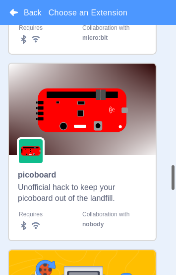

# Using a Sparkfun PicoBoard with Scratch 3

**2020-03-06 Update:**
  - Ubuntu 19.10 (nodejs v10.15.2): **OK**

  - Ubuntu 18.04 (nodejs v8.10.0): in picoboard dialogue, image transparently
    covers *Disconnect* and *Go to Editor* buttons.  To return to the Editor,
    close the dialogue or click on the blue background of the main page.




## Overview

The hard piece was already available in https://github.com/audetto/asi-link,
which provides a replacement for ScratchLink that serves up local
serial ports on a websocket server so that a local instance of Scratch 3
can connect to them.  The PicoBoard connects to your computer as a USB serial device.

Tiny changes to that, along with small changes to 3 of the official Scratch repos
let you run an instance of scratch-gui that will be able to use a PicoBoard plugged
into your computer.

This has only been tested on linux Ubuntu 19.10 and 18.04 so far.

## Installing from bash shell

```
# install node, npm, and git; skip if you have these
sudo apt-get install nodejs npm git p7zip-full

# make a directory and clone needed repos
export PICO=/home/$USER/picoboard
mkdir $PICO
cd $PICO
for r in scratch-picoboard scratch-vm scratch-gui scratch-blocks asi-link; do
    git clone --depth=1 https://github.com/jbrzusto/$r
    cd $r
    git checkout picoboard # fails for scratch-picoboard but doesn't matter
    cd ..
done

# follow the standard instructions for installing scratch 3 locally.
# (summarized from https://scratch.mit.edu/discuss/topic/289503/ )
# for me, npm-link only works with 'sudo'; your installation might not need it
cd asi-link
# not sure what these are used for, TBH
. ./get_certificates.sh
npm install
cd ../scratch-vm
npm install
sudo npm link
cd ../scratch-blocks
npm install
sudo npm link
cd ../scratch-gui
npm install
sudo npm link ../scratch-vm
sudo npm link ../scratch-blocks
npm run build
```


## Running from bash shell
```
# run the serial-port scratchlink replacement
cd $PICO/asi-link
sudo node app.js &  # sudo to ensure permission to the serial port

# open your web browser to the scratch 3 page you just built:
firefox $PICO/scratch-gui/build/index.html
```
